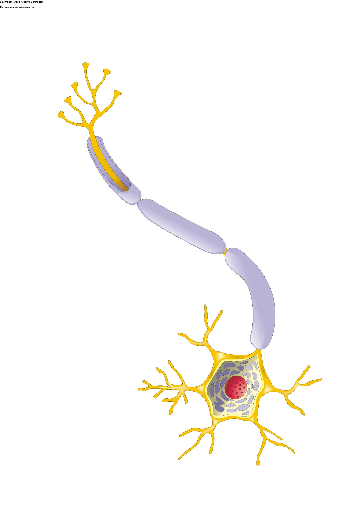

# Hola neurona

Aplicación interactiva desarrollada con **Streamlit** para comprender el funcionamiento básico de una **neurona artificial**.  
Permite experimentar con pesos, entradas y sesgo, visualizando cómo se calcula la salida de la neurona en distintos casos.

---

## 🚀 Características

La aplicación está organizada en **tres pestañas**, cada una representando un modelo incremental de neurona:

### 🔹 Una entrada
- Una entrada `x`
- Un peso `w`
- Salida calculada como:
  
  \[
  y = w \cdot x
  \]

---

### 🔹 Dos entradas
- Entradas: `x₀`, `x₁`
- Pesos: `w₀`, `w₁`
- Salida:
  
  \[
  y = w_0 x_0 + w_1 x_1
  \]

---

### 🔹 Tres entradas y sesgo
- Entradas: `x₀`, `x₁`, `x₂`
- Pesos: `w₀`, `w₁`, `w₂`
- Sesgo: `b`
- Salida:
  
  \[
  y = w_0 x_0 + w_1 x_1 + w_2 x_2 + b
  \]
